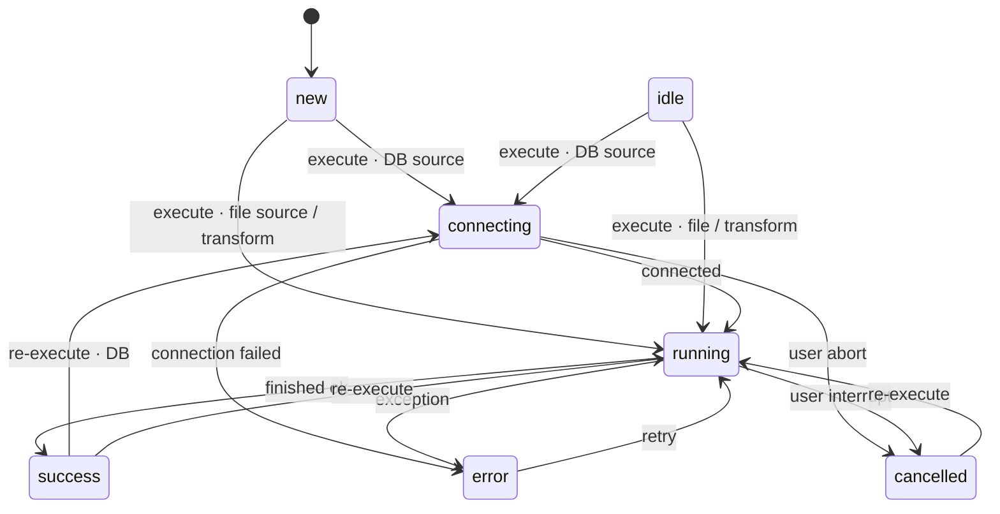

# Node State Model — Canonical Domain Spec

> **Status: canonical / authoritative.** This is the single source of truth for what a
> node's *run status*, *script state*, and *data state* mean in Shori, and how they
> transition. When code, UI copy, API fields, or conversation disagree about node state,
> **this document wins** — fix the divergence to match it, or change this document first.
>
> This is a *domain model* expressed as a **Ubiquitous Language** (DDD) plus a
> **statechart**. It deliberately does not duplicate architecture/setup — see
> [AGENTS.md](../AGENTS.md) for that. Read this before touching node status, cache
> status, load modes, the node-state view, or the data-preview panel.

**Audience:** humans and AI agents working on node state. **Why it exists:** the same
concept space is currently described by five overlapping, drifting vocabularies (see
§8). This doc collapses them into one.

---

## 1. The three orthogonal axes

A node's state is **three independent axes**. They do not collapse into one another, and
each can change without the others. Conflating them is the root cause of the historical
drift (e.g. putting "Loaded" — a *data* fact — into the *run* status enum).

```
NODE STATE = { run_status , script_state , data_state[location] }

  1. run_status    — what the engine is doing right now / did last        (transient)
  2. script_state  — is the node's editable config saved or dirty         (a gate)
  3. data_state    — per location: is data present, and is it fresh       (durable-ish)
```

| Axis | Question it answers | Values | Lifetime |
|---|---|---|---|
| **Run status** | "What is the engine doing?" | `new · idle · connecting · running(mode) · success · error · cancelled` | Transient (per run) |
| **Script state** | "Is the config edited but unsaved?" | `saved · modified` | Until saved |
| **Data state** (×3 locations) | "Is data here, and is it current?" | per location (see §1.3) | Survives runs; some survive restart |

### 1.1 Axis 1 — Run status

Run status is a **pure execution lifecycle**. It says nothing about *where data lives* or
*how fresh* it is — those are Axis 3. This matches the backend enum
[`NodeStatus`](../backend/app/models/pipeline.py) (`idle, connecting, running, success,
error, cancelled`), extended with `new` (never run) which today lives only in the derived
`NodeLifecycle`.

| Status | Meaning |
|---|---|
| `new` | Never executed. No data anywhere. |
| `idle` | Ran before, not running now, resting (no lingering outcome to show). |
| `connecting` | Establishing a DB connection (DB sources / live preview against a DB only). |
| `running(mode)` | Executing. `mode ∈ {preview, load, materialize}` (see below). |
| `success` | Last run finished OK. Resting; not busy. |
| `error` | Last run failed (includes connection-lost during `connecting`). Resting. |
| `cancelled` | User interrupted/aborted the run. Resting. |

> **The verbs "Loading", "Materializing", "live previewing" are NOT separate statuses.**
> They are `running` specialized by **mode**:
> - `running(preview)` → produces a **live preview** (Python memory, sampled).
> - `running(load)` → "Loading" → produces a **DuckDB in-memory** table.
> - `running(materialize)` → "Materializing" → produces a **DuckDB on-disk** table.
>
> The *outcome* of a successful run lands in Axis 3 (data state), not Axis 1.
> `success`/`error`/`cancelled` are resting states (functionally non-busy like `idle`) that
> retain the *last outcome* label for the UI.

`mode` is a first-class attribute of an in-flight or last run. **Implementation note:**
mode is currently *implicit* (inferred from `load_mode` and the separate preview
subsystem), not an explicit field on `NodeStatus` — see §8 gaps.

### 1.2 Axis 2 — Script state (a gate, not a status)

`saved | modified`. `modified` = the node's result-affecting config (SQL, query, source
config, preprocessing script) has been edited but not saved.

**Gate rule:** while `modified`, the node **may only be previewed** (`running(preview)`).
**Load and Materialize are disabled** until the change is saved. This keeps DuckDB
in-memory / on-disk tables from being built against an inconsistent definition.

On save, the node's cache key changes (§5), so any existing in-memory / on-disk data for
this node **and all downstream nodes** becomes **stale** automatically. No manual "mark
stale" step exists or is needed — staleness is *derived* (§5).

> Script state is currently a **frontend-only** concept (the editor's dirty/draft state).
> It is not persisted server-side.

### 1.3 Axis 3 — Data state, per location

Data state is indexed by **location**. There are three, and **they are not symmetric** —
treating them as co-equal causes bugs and hallucinations.

| Location | Produced by | Consumable by downstream nodes? | Survives restart? | Completeness | Has `stale`? |
|---|---|---|---|---|---|
| **`python_mem`** — live preview | `running(preview)` | **No** — eyeballs-only | No | **Sampled / partial** (e.g. 10k of 891k rows) | **No** — it is `live` or `empty`, never `stale` |
| **`duckdb_mem`** — scratch `:memory:` catalog | `running(load)` | **Yes** | No (RAM-only) | Complete | Yes |
| **`duckdb_disk`** — materialized in project file | `running(materialize)` | **Yes** | **Yes** | Complete | Yes |

Per-location values:

```
python_mem  : empty | live(sampled)
duckdb_mem  : empty | fresh | stale
duckdb_disk : empty | fresh | stale
```

**Why the asymmetry matters:** only `duckdb_mem` and `duckdb_disk` can feed a downstream
node, which is why the resolution rule (§6) ranks an upstream's copies by freshness then
recency and `python_mem` never appears. Live preview is for human inspection only — it is
sampled and is **not** registered as a catalog table the engine can join.

> **Target vs implemented.** `python_mem` as a *tracked, displayed* location is **new
> work**. Today the backend models only two locations (`NodeLoadMode = in_memory |
> materialized`, [pipeline.py](../backend/app/models/pipeline.py)); live preview is a
> *separate* subsystem ([preview_sessions.py](../backend/app/services/preview_sessions.py))
> and is not surfaced as a data-state location. See §8.

---

## 2. Ubiquitous Language (glossary)

| Term | Canonical meaning | Where it appears in code |
|---|---|---|
| **Node** | A vertex in the pipeline DAG (CSV / Excel / DB source, Transform, Export). | `NodeDefinition` |
| **Run status** | Axis 1. Execution lifecycle. | `NodeStatus` |
| **Run mode** | `preview \| load \| materialize` — what a run is producing. | `NodeLoadMode` (partial), preview subsystem |
| **Script state** | Axis 2. `saved \| modified`. Gates load/materialize. | frontend editor draft |
| **Data state** | Axis 3. Per-location presence + freshness. | cache-status `state` + `location` |
| **Location** | One of `python_mem \| duckdb_mem \| duckdb_disk`. | `LOCATION_MEMORY`, `LOCATION_MATERIALIZED` |
| **Live preview** | Sampled, eyeballs-only data in `python_mem`. Non-consumable. | `preview_sessions.py` |
| **Load** | Build a *complete* table in `duckdb_mem` (RAM, gone on restart). | `into_memory=True` |
| **Materialize** | Build a *complete* table in `duckdb_disk` (project file). | `into_memory=False` |
| **Fresh** | Stored cache key == recomputed cache key. | cache-status `state="fresh"` |
| **Stale** | Stored cache key != recomputed cache key (own or upstream change). | cache-status `state="stale"` |
| **Cache key** | Merkle fingerprint of result-affecting config + upstream keys. | `compute_cache_keys` |
| **Upstream / Downstream** | `edge.source` feeds `edge.target`. A node depends on its **upstreams**. **Do not say "parent/child".** | `upstream_ids` |
| **Derived card label** | The single flattened chip; a *projection* of the three axes, not a 4th source of truth. | `NodeLifecycle`, `_derive_lifecycle` |

**Terminology rule:** data flows `upstream → downstream` (`edge.source → edge.target`,
[pipeline_engine.py](../backend/app/services/pipeline_engine.py)). A node waits on its
**upstreams** (its inputs). The terms **parent/child are retired** — they invert the
dataflow direction and cause confusion.

---

## 3. Run-status statechart



- `connecting` applies **only** to DB sources (and live preview against a DB). File
  sources and transforms go straight to `running`.
- `running` always carries a **mode** (`preview | load | materialize`). The mode decides
  which Axis-3 location a successful run populates (§4).
- `success` / `error` / `cancelled` are **resting** states (non-busy, like `idle`) that
  keep the last-run label for display. "Connection lost" is an `error` outcome of the
  `connecting` phase.
- **Gate:** transitions into `running(load)` / `running(materialize)` are blocked while
  `script_state = modified` (§1.2).

---

## 4. Data-state transitions (per location)

Run outcomes drive data state. `<mode> run success` is the only event that *adds* data;
each location is cleared by its own events.

**`python_mem`** (no `stale`):
```
empty  --running(preview) success-->  live(sampled)
live   --script edit/save | connection lost | session TTL | manual stop/clear-->  empty
```

**`duckdb_mem`** (RAM-only):
```
empty        --running(load) success-->        fresh
fresh        --cache key mismatch (own/upstream)-->  stale     [derived, see §5]
stale|fresh  --running(load) success-->        fresh          (overwrite in place)
fresh|stale  --process restart-->              empty          (scratch catalog is RAM-only)
fresh|stale  --manual free/drop-->             empty
```

**`duckdb_disk`** (persisted):
```
empty        --running(materialize) success-->  fresh
fresh        --cache key mismatch (own/upstream)-->  stale     [derived, see §5]
stale|fresh  --running(materialize) success-->  fresh          (overwrite in place)
fresh|stale  --process restart-->               (unchanged; survives)
fresh|stale  --manual delete-->                 empty
```

> **Stale data stays readable.** Stale `duckdb_mem` / `duckdb_disk` tables are still real
> tables: they remain **selectable in the data-preview panel** and are overwritten only on
> reload/rematerialize. They are, however, **not trusted for downstream execution** — a
> pipeline run recomputes a stale node rather than consume it (§6).

---

## 5. Freshness & invalidation (the cache-key rule) — IMPLEMENTED & VERIFIED

Freshness is **not** "script modified and saved". It is a **Merkle cache-key comparison**,
already implemented end-to-end:

> A node's cache key hashes its **result-affecting** config **plus its upstreams' cache
> keys**. Editing any source therefore changes the keys of **every descendant** (Merkle
> propagation). "Is this table still valid?" is a pure comparison against the key recorded
> when the table was built.
> — [cache_keys.py](../backend/app/services/cache_keys.py)

**Two consequences (both required, both true today):**

1. **Staleness propagates transitively downstream.** Editing an upstream source marks all
   descendants stale, not just the edited node. For a pipeline tool this is the whole
   point.
2. **Only result-affecting changes count.** Renaming a node, moving it on the canvas, or
   rotating a DB password does **not** make data stale — those are deliberately excluded
   from the key ([cache_keys.py](../backend/app/services/cache_keys.py): connection
   passwords, Oracle `fetch_config`, `table_name`, `label`, `position`). So "modified and
   saved" *overcounts*; **"result-affecting fingerprint changed" is the precise rule.**

**Stale is derived, never stored.** There is no persisted "is_stale" flag. On read, the
cache-status endpoint recomputes keys and compares:

```
fresh  ⇔  meta.cache_key == recompute(node)         # else: stale
```

— [execution.py `get_cache_status`](../backend/app/routers/execution.py). The engine's
`cached_result` gates re-execution on the same comparison
([pipeline_engine.py](../backend/app/services/pipeline_engine.py)), so a stale node is
recomputed on the next run automatically. Because it is a live comparison, no code has to
"remember" to invalidate anything.

**Verification trail (compute → persist → compare):**
- Compute: `compute_cache_keys(pipeline)` walks the DAG, folding sorted upstream keys into
  each node's key.
- Persist: the key is threaded through the load and written to
  `_shori_node_meta.cache_key` when the table is built.
- Compare: cache-status and `cached_result` both compare stored vs recomputed.

No code change was required; this section documents existing, verified behavior.

---

## 6. Downstream resolution & the load/materialize prompt

For a downstream node to run, **every upstream must provide consumable data**. When an
upstream has both a `duckdb_mem` and a `duckdb_disk` copy, pick between them by:

```
1. Among an upstream's PRESENT DuckDB copies (in_memory, materialized), choose by:
     a. freshness — a fresh copy beats a stale copy;
     b. then recency — if both are fresh (or both stale), the more recently loaded
        copy (greater finished_at) wins.
2. If the chosen copy is stale → recompute it in place (no prompt; its location is known).
3. If the upstream has NO DuckDB copy at all → PROMPT for a destination
     (Load → duckdb_mem, or Materialize → duckdb_disk).
   python_mem NEVER satisfies an upstream and is ignored throughout.
```

- **Precedence:** `fresh > stale`, tie-broken by **most-recent load (`finished_at`)** — *not*
  a fixed location order. `python_mem` never participates; prompt only when neither DuckDB
  copy exists.
- **Mechanism.** Because copies share the node's `table_name` across two catalogs, the engine
  resolves this per-run with **temporary run-scoped views**: for each upstream it creates a
  view (in a run schema placed first on the search_path) pointing at the chosen copy, so the
  unqualified upstream reference in user SQL resolves correctly. A global search-path order
  can't express per-node precedence and pollutes `current_database()`/`CHECKPOINT`, so it is
  deliberately not used.
- **Batch the prompt.** Collect *all* upstreams that need a destination (case 3) and show
  them in **one confirmation window** so the user picks destinations for every applicable
  node at once, rather than one dialog per node.
- **Gate:** any upstream with `script_state = modified` blocks the run — it must be saved
  first (§1.2).

> **Storage.** `_shori_node_meta` is keyed by `(node_id, location)` so a node tracks its
> in-memory and materialized copies independently (each with its own `cache_key` and
> `finished_at`) — [duckdb_manager.py](../backend/app/services/duckdb_manager.py). This is
> what makes the freshness/recency comparison above possible.

---

## 7. Visualization mapping

The three axes render differently depending on surface:

| Surface | Axis 1 (run) | Axis 2 (script) | Axis 3 (data) |
|---|---|---|---|
| **Node-state table** (the detailed view) | Run-status badge | "modified" marker | **3 dots**, separate columns for schema/table/rows |
| **Compact canvas node** | Status badge | dirty dot | **Derived flattened chip** (`NodeLifecycle`) — *document as derived* |

**The 3 dots (data state):**
- Fixed positions: `[ python_mem | duckdb_mem | duckdb_disk ]`. Position already encodes
  location.
- Color when present (canonical palette): `python_mem` = **green**, `duckdb_mem` =
  **amber/yellow**, `duckdb_disk` = **orange**. **Grey** when `empty`.
- **Stale is shown by a badge or dashed ring — NOT by opacity.** Opacity differences fail
  for low-vision / colorblind users; the mockup's explicit `Stale` pill is the right
  pattern. Opacity may be a *secondary* reinforcement at most.
- The `python_mem` dot carries a **"sampled/partial"** glyph (it is never "complete"),
  distinguishing it from the two complete DuckDB dots.
- During `running(load)` / `running(materialize)`, the **target dot pulses** — this is how
  Axis 1 and Axis 3 connect visually.

**Derived label note:** `NodeLifecycle` (`new/idle/in_memory/materialized/running/error`,
via `_derive_lifecycle`) is a **projection** of the three axes for compact display. It is
**not** a fourth source of truth — never persist decisions against it; derive it from the
axes.

> **Palette — RESOLVED (canonical = green/yellow/orange).** `python_mem` = green,
> `duckdb_mem` = yellow, `duckdb_disk` = orange. This supersedes both the old
> `NodeCacheChip` palette (violet/sky) **and** the original mockup's teal/violet/blue.
> [NodeCacheChip.tsx](../frontend/src/components/flow/NodeCacheChip.tsx) has been aligned
> (yellow = in-memory, orange = materialized).

---

## 8. Vocabulary reconciliation & implementation status

### 8.1 The five vocabularies → canonical axes

| Existing artifact | Values | Canonical mapping |
|---|---|---|
| `NodeStatus` (backend) | `idle, connecting, running, success, error, cancelled` | **Axis 1**, exactly. Add `new`. Add explicit `mode`. |
| `StatusTone` (frontend) | + `cached` | Axis 1 + a presentational "served from cache" tone (a *fresh-data* fact, Axis 3). |
| cache-status `state` | `missing, loading, failed, fresh, stale` | **Axis 3** freshness/presence (`missing`→`empty`, `loading`→run in flight, `failed`→`error`). |
| `NodeLifecycle` | `new, idle, in_memory, materialized, running, error` | **Derived projection** (§7). Not an axis. |
| Mockup column | `Success, Idle, Cached` | Axis 1 (`success`/`idle`) + cached tone. |

### 8.2 Implementation status

| Concept | Status | Notes / gap |
|---|---|---|
| Run status lifecycle | ✅ Implemented | `NodeStatus`. `new` only in `NodeLifecycle`; surface it on the status axis. |
| Run **mode** verbs (Loading/Materializing) | ✅ Implemented | Derived on the frontend from `load_mode`/operation via `StatusBadge` `mode` — deliberately not threaded through the backend result (redundant with `location`). |
| Script state gate | ⚠️ Frontend-only | Editor dirty state; not persisted; gate enforced in UI. |
| `duckdb_mem` / `duckdb_disk` data state | ✅ Implemented | `NodeLoadMode`, `meta.location`, cache-status. |
| `python_mem` live preview (DB + Transform) | ✅ Implemented, verified live | Held-cursor sessions in `preview_sessions.py`: DB sources (existing) + `DuckDBPreviewSession` for transforms (gated on upstreams, connection-local temp views for resolution). Confirmed end-to-end in a running app: live session → green dot → real DuckDB rows streamed → promote via Load/Materialize. CSV: dot wired to `csvPreprocessArtifacts` (green once a reviewed preprocessed sample exists; "—" for plain CSV). Excel: still deferred (dot always "—") per decision. |
| Merkle cache-key freshness | ✅ Implemented & verified | §5. No change needed. |
| Transitive downstream invalidation | ✅ Implemented | §5, consequence 1. |
| **Independent per-location presence** | ✅ Implemented | `_shori_node_meta` keyed by `(node_id, location)`; in-memory + materialized copies coexist, each with its own `cache_key`/`finished_at`. §6. |
| **Downstream resolution precedence** (§6) | ✅ Implemented | `DuckDBManager.consumable_location` (fresh > stale, mem > disk, recency) + run-scoped views in `execute_transform`, wired via `compute_upstream_resolution` in the pipeline loop and both `/node` endpoints. |
| Batched load/materialize prompt | ✅ Implemented | `LoadDestinationDialog` (design-system) + store's `nodesNeedingDestination` resolver + `loadDestinationPrompt` state/actions. Walks the full ancestor chain, gates only on "no data in either location" (not staleness), shown as one dialog covering every applicable node. Wired into both `runTransformPreview` (materialize path) and `startLivePreview` (view-only path, incl. a defensive 409 fallback if client cache was stale). |
| Node-state table + route | ✅ Implemented | `NodeStateTable` (design-system) + `NodeStatePage` at `/projects/:id/node-state`, toolbar Canvas ↔ Node state toggle. Verified live: summary counts, per-row dots, schema/table/rows all correct against real backend state. |
| Dot palette vs chip palette | ✅ Resolved | Canonical = green/yellow/orange (§7). `NodeCacheChip` updated: yellow = in-memory, orange = materialized. |
| "Loaded" chip label vs "Load" verb | ✅ Resolved | `NodeCacheChip` on-disk label renamed **"Loaded" → "Materialized"**. Canonical UI copy: `python_mem`="Live preview", `duckdb_mem`="In memory", `duckdb_disk`="Materialized". The mockup's "Loaded" pill should follow suit. |
| Stale dot on canvas reflects in-place edits | ✅ Fixed | `updateNodeData` now calls `scheduleCacheStatusRefresh` when a result-affecting field changes, so the canvas dots go stale together with the (pre-existing) preview-tab "Stale" badge instead of lagging until an unrelated refresh. |

---

## 9. Decisions log

Locked decisions for this model (so they don't get relitigated):

1. **Run status is pure lifecycle.** "Loading/Materializing/Live-view/Stale" are *not*
   run statuses — they are run *modes* (Axis 1) or *data states* (Axis 3).
2. **Three axes, not a triad of states.** "Location" is the index Axis-3 varies over, not a
   separate axis.
3. **`python_mem` is tracked & displayed but stamped non-consumable, non-persisted,
   sampled.** It never satisfies a downstream dependency.
4. **Staleness = result-affecting Merkle cache-key mismatch**, propagating downstream;
   derived, never stored. Not "modified and saved".
5. **Use `upstream`/`downstream`; retire `parent`/`child`.**
6. **Stale is shown by badge/ring, not opacity** (accessibility).
7. **Node-state table shows axes separately; the compact canvas node uses `DataStateDots`
   directly** (not the derived flattened chip). Tried both in the running app — the 3 dots
   read fine at canvas scale, including the stale dashed-ring, so `NodeCacheChip` now
   renders dots instead of the old text pill. The flattened `NodeLifecycle` label remains
   available for a denser view if one is ever needed, but is not used on canvas today.
8. **Canonical location palette = green (`python_mem`) / yellow (`duckdb_mem`) / orange
   (`duckdb_disk`).** Supersedes the mockup's teal/violet/blue and the old chip's
   violet/sky. `NodeCacheChip` aligned.

---

*Keep this document and the code mutually honest. If you change node state semantics,
update this file in the same change.*
